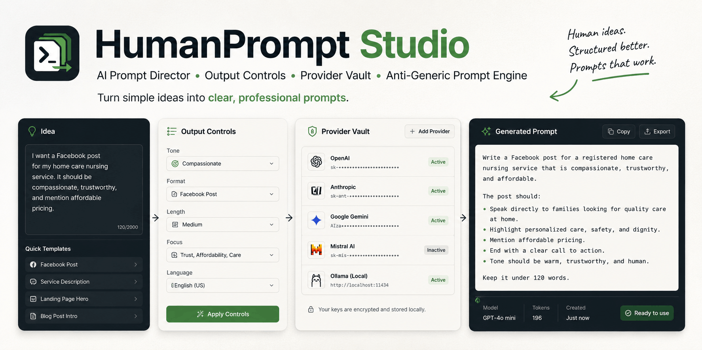

<p align="center">
  
</p>
# HumanPrompt Studio


**HumanPrompt Studio** is a lightweight PHP prompt director that turns simple user requests into stronger AI-ready prompts, briefs, and final content for ads, images, videos, websites, code, articles, studies, plans, and general tasks.

It is not just a prompt expander. It classifies the request, fixes common English spelling/grammar mistakes, detects missing details, applies quality constraints, supports multiple output styles, and can use live AI providers through an encrypted Provider Vault.

---

## Features

- **Auto Prompt Director**: detects whether the request is an ad, image, video, website, code task, article, study, analysis, plan, or general task.
- **Output Goal controls**:
  - Improve as Prompt
  - Generate Final Content
  - Create Brief + Prompt
  - Analyze Request
  - Create Variations
- **Output Style controls**:
  - Direct Prompt
  - Structured Prompt
  - Short Prompt
  - Deep Professional Prompt
  - Tool-Specific Prompt
- **Target Tool selection**: ChatGPT, Claude, Gemini, Facebook, Canva, Figma, Webflow, Framer, Midjourney, Ideogram, Veo, and more.
- **English spelling and grammar correction** enabled by default.
- **Anti-generic AI style engine** for better visual and creative prompts.
- **Encrypted Provider Vault** for API keys and model settings.
- **Live AI provider support** with local fallback.
- **Prompt score** and improvement explanation.
- **No database required** for the MVP: JSON-based storage.

---

## Supported Providers

Provider presets include:

- OpenAI
- OpenRouter
- DeepSeek
- Kimi / Moonshot AI
- DeepInfra
- Together AI
- Groq
- Mistral AI
- Perplexity
- Novita AI
- Fireworks AI
- Cerebras
- Gemini
- Claude
- Grok / xAI
- Custom OpenAI-compatible provider
- Local Rule Engine

> API keys are stored encrypted in `data/ai_providers.json`, which is intentionally ignored by Git.

---

## Requirements

- PHP 8.1 or newer
- PHP extensions commonly available on shared hosting:
  - `json`
  - `openssl`
  - `curl`
  - `session`
- Apache, Nginx, XAMPP, Laragon, or PHP built-in server

No Composer packages are required.

---

## Quick Start

Clone the repository:

```bash
git clone https://github.com/YOUR_USERNAME/humanprompt-studio.git
cd humanprompt-studio
```

Create your environment file:

```bash
cp .env.example .env
```

Run locally:

```bash
php -S localhost:8000 -t public
```

Open:

```text
http://localhost:8000
```

Provider Vault:

```text
http://localhost:8000/providers.php
```

---

## First-Time Provider Vault Setup

Open:

```text
http://localhost:8000/providers.php
```

If the vault is not configured, create it from the page:

1. Enter a new vault password.
2. Leave the encryption secret empty if you want the app to generate one automatically.
3. Click **Create Vault**.
4. Unlock the vault.
5. Choose a provider.
6. Paste the provider API key.
7. Add the model name.
8. Save.

The app writes these values to `.env`:

```env
HUMANPROMPT_SECRET_KEY=generated-secret
HUMANPROMPT_ADMIN_PASSWORD_HASH=generated-password-hash
```

Important: after saving API keys, do not change `HUMANPROMPT_SECRET_KEY`, because it is required to decrypt saved provider keys.

---

## Runtime Files Not Committed to Git

The following files are ignored because they may contain secrets or user data:

```text
.env
data/ai_providers.json
data/prompt_history.json
storage/logs/*
storage/cache/*
storage/backups/*
```

Example starter files are included:

```text
data/ai_providers.example.json
data/prompt_history.example.json
```

---

## Example

Input:

```text
make an ad for Facebook post
for my business
Registered Nurse
for all Home Care Nursing Interventions
With Good Price and High Concern
0000000000
Call me now
```

Improved output can include:

- Final Prompt
- Short Version
- Negative Prompt
- Prompt Score
- Why this is stronger
- Provider Note
- Spell correction details

---

## Local PHP Checks

Run syntax checks:

```bash
composer run check
```

Or without Composer:

```bash
find app config public -name '*.php' -print0 | xargs -0 -n1 php -l
```

On Windows PowerShell:

```powershell
Get-ChildItem app,config,public -Filter *.php -Recurse | ForEach-Object { php -l $_.FullName }
```

---

## Project Structure

```text
humanprompt-studio/
  app/
    Helpers/
    Repositories/
    Services/
  config/
  data/
    *.json
  public/
    assets/
    index.php
    api.php
    providers.php
  storage/
    backups/
    cache/
    logs/
  docs/
  .env.example
  .gitignore
  README.md
```

---

## Documentation

- [Installation](docs/INSTALLATION.md)
- [Provider Vault](docs/PROVIDER_VAULT.md)
- [Output Controls](docs/OUTPUT_CONTROLS.md)
- [GitHub Upload Steps — Arabic](docs/GITHUB_UPLOAD_STEPS_AR.md)
- [Release Checklist](docs/RELEASE_CHECKLIST.md)
- [Roadmap](docs/ROADMAP.md)

---

## Security Notes

- Never commit `.env`.
- Never commit real API keys.
- Keep `data/ai_providers.json` private.
- Keep `data/prompt_history.json` private if prompts may contain sensitive data.
- Serve the app from the `public/` directory when possible.
- Keep `APP_DEBUG=false` in production.

---

## License

MIT License. See [LICENSE](LICENSE).
